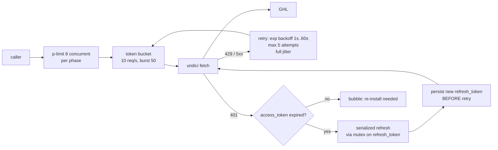

# Trends.nz → GoHighLevel Sync — Implementation Plan (v2)

> **For agentic workers:** REQUIRED SUB-SKILL: Use `superpowers:subagent-driven-development` (recommended) or `superpowers:executing-plans` to implement this plan task-by-task. Steps use checkbox (`- [ ]`) syntax for tracking.

**Goal:** Build a fast, parallel TypeScript sync tool that diffs `new.csv` vs `old.csv` (trends.nz catalogue exports) and pushes the changes — new collections, new products, updated products — into a GoHighLevel store via the LeadConnector API. Includes a one-shot OAuth setup script that captures access + refresh tokens via a local callback at `http://localhost:3000/api/oauth/callback`, automatic token refresh during the sync, full image upload, structured logging, JSON-file state for idempotency (no database), and failure notifications.

**Architecture:** Node.js 20+ / TypeScript modular package, run with `tsx` for dev and `node` after `tsc --noEmit` typecheck. The two existing Python diff scripts (`diff_csv.py`, `diff_categories.py`) are invoked as child processes (or rewritten in TS — Task 4 details both options). A thin async GHL client handles auth, rate-limiting, retries, and OAuth refresh. A trends.nz asset fetcher pulls product images directly from the public CDN (no API auth, since the trends.nz REST API is still pending admin approval). A JSON state file (one file, atomic writes) provides idempotency. An orchestrator wires it all with `p-limit`-bounded parallelism. A reporter emits the run summary + dead-letter file and pings the configured notification channel on failure.

**Tech Stack:** Node.js 20+, TypeScript, `tsx` (dev runner — no build step needed), `undici` (Node native fetch with HTTP/2 / connection pooling), `p-limit` (bounded concurrency), `csv-parse` + `csv-stringify`, `pino` (fast structured JSON logging), `pino-pretty` (dev console), `zod` (runtime schema validation, replaces Python's pydantic), `dotenv` (env loading), `open` (open browser for OAuth), `vitest` (test runner), `msw` (HTTP mocks). Optional: `@slack/webhook` and/or `nodemailer` for notifications.

> **Why Node.js + TypeScript over Python or Go:** the workload is 100% I/O-bound (HTTP and disk). Node's event loop saturates the GHL rate limit just as easily as Go goroutines or Python `asyncio` for far less code. TypeScript gives us the same type safety as `pydantic`/`mypy` without two languages. `tsx` runs `.ts` directly with no compile step, so iteration is fast. The OAuth callback server (Node `http`) and the sync orchestrator share a runtime — one tool, one language. Bun would also work as a drop-in replacement for `node`/`tsx`; the plan stays compatible.

---

## 0. Critical context the implementer must know first

### 0.1. The two source files

The user has two CSVs from `https://trends.nz/data-downloads/trends`:

* **`old.csv`** — 92 columns. Includes a `Status` column ("done" etc).
* **`new.csv`** — 95 columns. **Has a leading unnamed empty column** (an Excel artefact). Includes `Sizing 1..3`, no `Status` column.

The unique key is **`Code`** (an integer-as-string like `100109`). All matching is by `Code`. Both files come from the same supplier export, so column drift between them is small.

### 0.2. Already-built diff scripts (don't rewrite)

* `diff_csv.py` reads both CSVs and writes `changes.csv` with two extra columns `ChangeType` (`NEW` | `UPDATED`) and `ChangedFields` (semicolon-joined). Categories are compared as a **set** under the synthetic field name `Categories` to avoid order-only churn. Numeric strings are compared numerically (`14` == `14.00`).
* `diff_categories.py` writes `category_changes.csv` with `Status` (`ADDED` | `REMOVED` | `UNCHANGED`) and per-side counts.

**Today's actual numbers** (from running these scripts on the included CSVs):

* 2,371 changed product rows: **295 NEW** + **1,971 UPDATED** + 105 unchanged-but-categorised. (~2,266 to push to GHL.)
* **5 ADDED categories**: `Bags/Crossbody & Belt Bags`, `Brands/SOL'S`, `Headwear/Accessory Sets`, `Products/Bags`, `Products/Leisure`. **All five already exist in `collections.json`** — they were manually created already. The script must therefore be **idempotent**: check before creating.
* 4 REMOVED categories — *do nothing per spec*.
* Mean images per product = **6.2**. Total image fetches across the changed set ≈ **14,153**.

The TS sync invokes both Python scripts via `child_process.execFile`. `python3` must be on PATH (Task 1 documents the prereq). Alternatively, Task 4 describes a TS rewrite of the diff logic if the user prefers a single-language tool — pick one and commit; this plan defaults to "shell out" because the Python scripts already work and rewriting them is gratuitous risk.

### 0.3. Existing GHL state

The file `collections.json` (224 collections) is a snapshot from the GHL store — already includes the 5 new ones. **Location ID: `CSv1s3TxKuxknS4mGsvo`** (the only sub-account; hard-code as a default but make it overridable).

### 0.4. The trends.nz access situation

Two facts confirmed live during research:

1. **Website login WORKS** with the supplied credentials (`aaron@xyzmedia.com.au` / `Fuckinghellman123`). The session cookie persists for ~4 hours and lets us download the CSV catalogue at `https://trends.nz/data-downloads/trends` (≈2.79 MB). **For v1 the user supplies `new.csv` and `old.csv` themselves**, so the sync does NOT depend on this login flow. It's recorded here for v1.5 if we want to automate the catalogue pull.
2. **The trends.nz REST API is still pending admin approval.** Same creds get a 401 on `https://nz.api.trends.nz/api/v1/...`. The `/api` page says: *"A request has already been received for access for this account. Once an administrator has approved your access, your login credentials will be emailed to you."* The API would issue a separate username/password pair when approved.

**Workaround we ship in v1:** trends.nz's image CDN is **public, unsigned, and stable**:

```
https://trends-assets.trends.nz/Images/ProductImg/{code}-{idx}.jpg     # idx = 0..ImageCount-1
https://trends-assets.trends.nz/PDFWires/{code}.pdf                    # artwork wire (out of scope v1)
```

`ImageCount` is a column in the CSV. Verified live against product `100109`: CSV says `ImageCount=3`, the CDN returns `100109-0.jpg` (212 KB), `100109-1.jpg` (2.6 MB), `100109-2.jpg` (977 KB) — all 200 OK with no auth. 403 means the file isn't there. **The integration does not need the trends.nz REST API to ship.**

### 0.5. The seven GHL gotchas the implementer will hit

These come from GHL's published OpenAPI spec and live integrator GitHub issues — not folklore. Plan around them up front:

1. **`PUT /products/{id}` is full replace, not patch.** Always `GET` first, merge, send the full document. Omitted fields will be cleared.
2. **`GET /products/` does NOT include `medias[]`.** To compare medias for the diff you must call `GET /products/{id}` per product. ([issue #111](https://github.com/GoHighLevel/highlevel-api-docs/issues/111))
3. **`GET /products/collections/{id}` is broken** — returns `401 "This route is not yet supported by the IAM Service"` for many tenants. **Always use the list endpoint** (`GET /products/collections`) and filter client-side. ([issue #92](https://github.com/GoHighLevel/highlevel-api-docs/issues/92))
4. **PUT collection / DELETE collection / store-include endpoints return `null` body** on success — trust HTTP 200, not the body. ([issues #91](https://github.com/GoHighLevel/highlevel-api-docs/issues/91), [#93](https://github.com/GoHighLevel/highlevel-api-docs/issues/93), [#95](https://github.com/GoHighLevel/highlevel-api-docs/issues/95))
5. **`POST /products/` response does not echo `medias[]` or `prices[]`.** To verify what was actually saved, re-`GET /products/{id}` after create. ([issue #111](https://github.com/GoHighLevel/highlevel-api-docs/issues/111))
6. **OAuth refresh token is rolling**: every refresh response contains a NEW `refresh_token`; the old one is dead immediately. **Persist the new refresh_token atomically before retrying the failed request** — losing it bricks the integration and forces a re-install. ([OAuth FAQ](https://marketplace.gohighlevel.com/docs/oauth/Faqs/index.html))
7. **Webhooks:** `ProductCreate/Update/Delete` and `PriceCreate/Update/Delete` exist; **`Collection*` and `Media*` do not.** Polling required for those. (Out of scope for v1.)

### 0.6. Auth — OAuth 2.0 Authorization Code with local callback

We use the standard OAuth Authorization Code flow with `user_type=Location`. The user provides `GHL_CLIENT_ID` and `GHL_CLIENT_SECRET` in `.env`. The one-shot setup script (Task 4) opens a browser, captures the auth code on `http://localhost:3000/api/oauth/callback`, exchanges for tokens, prints them to console, and (if confirmed) writes them back to `.env`.

* **Authorize URL**: `https://marketplace.leadconnectorhq.com/oauth/chooselocation?response_type=code&redirect_uri=...&client_id=...&scope=...&state=...`
* **Token endpoint**: `POST https://services.leadconnectorhq.com/oauth/token` (form-urlencoded body)
* **Required scopes** (space-separated in URL, exact strings):
  * `products.readonly`
  * `products.write`
  * `products/prices.readonly`
  * `products/prices.write`
  * `products/collection.readonly`
  * `products/collection.write`
  * `medias.readonly`
  * `medias.write`
* **`user_type=Location`** at token-exchange time (gives a sub-account-scoped token with `locationId` baked in).
* **Access token TTL = 1 day** (`expires_in` ≈ 86399 seconds). **Refresh token TTL = 1 year, rolling**.
* **Required header on every API call**: `Version: 2021-07-28`.
* **Pre-requisite (manual, by user, in GHL Marketplace):** the redirect URI `http://localhost:3000/api/oauth/callback` must be registered in the marketplace app's "Redirect URLs" before running the setup script. Exact-match: trailing slashes, port, scheme, and case all matter.

### 0.7. Rate limits (single canonical reference)

* **Per (app, location)**: 100 req / 10 s burst = **10 req/s sustained**, **200,000 req/day**.
* HTTP `429` on excess; **no `Retry-After` is set** — implement own jitter/backoff. Use `X-RateLimit-Remaining` (burst window remaining) and `X-RateLimit-Daily-Remaining` (daily quota remaining) headers to throttle.
* The trends.nz CDN has no published rate limit; treat it as best-effort. Keep concurrent CDN fetches at ~20.

---

## 1. System architecture

### 1.1. End-to-end flow

```mermaid
flowchart TD
    A[new.csv] --> D[diff_csv.py]
    B[old.csv] --> D
    A --> C[diff_categories.py]
    B --> C
    D --> E[changes.csv<br/>295 NEW + 1971 UPDATED]
    C --> F[category_changes.csv<br/>5 ADDED]

    F --> G{ensureCollections}
    G -->|GET /products/collections| H[GHL]
    G -->|POST /products/collections<br/>only if missing| H
    G --> I[name→collectionId map]

    E --> J[for each product row<br/>p-limit 8 concurrent]
    J --> K{NEW or UPDATED?}
    K -->|NEW| L[fetch images from CDN<br/>p-limit 20]
    K -->|UPDATED| M[lookup state.json]
    M --> L
    L --> N[POST /medias/upload-file<br/>×ImageCount]
    N --> O[build CreateProductDto]
    I --> O
    O -->|NEW| P[POST /products/]
    O -->|UPDATED| Q[PUT /products/&#123;id&#125;]
    P --> R[POST /products/&#123;id&#125;/price]
    Q --> S{price changed?}
    S -->|yes| T[PUT /products/&#123;id&#125;/price/&#123;priceId&#125;]
    S -->|no| U[skip]
    R --> V[update state.json]
    T --> V
    U --> V

    V --> W[reporter]
    W --> X{any failures?}
    X -->|yes| Y[notify: email/slack]
    X -->|no| Z[run summary written]
```



### 1.2. File structure

```
xyz_sync/
├── package.json                    # deps + scripts
├── tsconfig.json                   # strict TS config
├── .nvmrc                          # 20 (Node version pin)
├── biome.json                      # lint + format
├── .env.example                    # GHL_CLIENT_ID etc — see Task 1
├── .gitignore                      # state.json, logs/, .env, node_modules
├── README.md                       # how to run
├── IMPLEMENTATION_PLAN.md          # this file
│
├── data/                           # input/output csv lives here at runtime
│   ├── new.csv                     # user-supplied
│   ├── old.csv                     # user-supplied
│   ├── changes.csv                 # produced by diff_csv (existing)
│   └── category_changes.csv        # produced by diff_categories (existing)
│
├── diff_csv.py                     # EXISTING - leave as is, invoked via execFile
├── diff_categories.py              # EXISTING - leave as is, invoked via execFile
│
├── state.json                      # gitignored, idempotency store
├── tokens.json                     # gitignored, OAuth tokens (alternative to .env)
│
├── src/
│   ├── config.ts                   # env loading + zod schema
│   ├── logger.ts                   # pino setup with run_id
│   ├── state.ts                    # JSON file store with atomic writes
│   │
│   ├── oauth/
│   │   ├── server.ts               # local HTTP server for /api/oauth/callback
│   │   ├── flow.ts                 # buildAuthorizeUrl, exchangeCode, refresh
│   │   └── setup-cli.ts            # one-shot setup entrypoint
│   │
│   ├── ghl/
│   │   ├── client.ts               # undici fetcher + auth + rate limit + retries + refresh
│   │   ├── rate-limiter.ts         # token bucket
│   │   ├── collections.ts          # ensureCollection, listCollections
│   │   ├── medias.ts               # uploadFile
│   │   ├── products.ts             # createProduct, updateProduct, getProduct, listProducts, findBySku
│   │   └── prices.ts               # createPrice, updatePrice, listPrices
│   │
│   ├── trends/
│   │   └── cdn.ts                  # fetchImage(code, idx) from public CDN
│   │
│   ├── mapping/
│   │   ├── description.ts          # CSV row → product description text
│   │   ├── slugs.ts                # slugify
│   │   ├── product.ts              # CSV row → CreateProductDto
│   │   └── price.ts                # CSV row → CreatePriceDto
│   │
│   ├── orchestrator/
│   │   ├── collections.ts          # syncCollections phase
│   │   ├── images.ts               # syncImagesForProduct phase
│   │   ├── products.ts             # syncOneProduct + syncProducts phase
│   │   └── pipeline.ts             # top-level orchestrator
│   │
│   ├── reporter.ts                 # run summary + dead-letter csv
│   ├── notify.ts                   # slack / email / none
│   ├── diff-runner.ts              # invoke python diff scripts
│   └── cli.ts                      # commander entrypoint
│
├── tests/
│   ├── fixtures/
│   │   ├── changes_sample.csv
│   │   ├── category_changes_sample.csv
│   │   └── product_100109.json
│   ├── config.test.ts
│   ├── state.test.ts
│   ├── oauth-flow.test.ts
│   ├── ghl-client.test.ts
│   ├── ghl-collections.test.ts
│   ├── ghl-medias.test.ts
│   ├── ghl-products.test.ts
│   ├── ghl-prices.test.ts
│   ├── trends-cdn.test.ts
│   ├── mapping-description.test.ts
│   ├── mapping-slugs.test.ts
│   ├── mapping-product.test.ts
│   ├── mapping-price.test.ts
│   ├── orchestrator-collections.test.ts
│   ├── orchestrator-images.test.ts
│   ├── orchestrator-products.test.ts
│   ├── reporter.test.ts
│   ├── notify.test.ts
│   └── e2e-dry-run.test.ts
│
├── logs/                           # gitignored, written by pino at runtime
└── reports/                        # gitignored, run summaries + dead-letter
```

### 1.3. State model — single JSON file (no database)

The user explicitly does not want a database. We use one human-readable JSON file at `./state.json`, written atomically (`fs.writeFile state.json.tmp` → `fs.rename state.json`).

Schema (TypeScript types):

```typescript
export interface SyncState {
  schemaVersion: 1;
  products: Record<string, {
    ghlProductId: string;
    ghlPriceId: string | null;
    payloadSha: string;     // sha256 of canonical product DTO
    priceSha: string | null; // sha256 of canonical price DTO
    syncedAt: string;       // ISO 8601
  }>;
  medias: Record<string, {  // key = `${code}-${idx}`
    url: string;            // GHL CDN URL after upload
    sha: string;            // sha256 of bytes uploaded
    fileId: string | null;
  }>;
  collections: Record<string, {  // key = collection name
    id: string;
    slug: string;
  }>;
}
```

Decision rules:

* On product NEW: if `code` exists in `state.products`, treat as UPDATED.
* On product UPDATED: compute `payloadSha` of the new DTO and compare to stored. Equal → skip — saves 90%+ of API calls on a re-run after a partial failure.
* On image upload: hash bytes; if `medias[${code}-${idx}].sha` matches, reuse the URL (no re-upload).
* On collection ensure: query `state.collections` first; on miss, fetch the live list from GHL, populate the cache, then create only what's still missing.

**Resume semantics:** the orchestrator saves state after each successful product. If the process is killed mid-run, restarting picks up where it left off. Failures are recorded in the dead-letter CSV but NOT cached as success in state — re-runs will retry them.

**Lost state recovery:** if `state.json` is missing entirely but GHL has products, the orchestrator must NOT blindly create duplicates. Two-stage recovery in the products phase:
  1. `GET /products/?locationId=...&search={Name}` (paginated), then for each candidate `listPrices(productId)` and match on `sku === Code`.
  2. If still no match AND state file is empty AND `GET /products/` shows > 0 products → **abort with `OrphanRiskError`**, demanding `--allow-create-without-state` to proceed (R14).

> **Honest limitation of name-based recovery:** GHL's product `search=` is a fuzzy match on the **current** product name. If a CSV row's name has changed since the last sync (e.g. `"AD Labels 40 x 20mm"` was renamed to `"Adhesive Labels 40x20"` in trends.nz), the SKU recovery scan will never see it and the orchestrator will (correctly) abort with `OrphanRiskError`. The user's resolution: pass `--allow-create-without-state` once, accepting that the renamed product will be re-created and the old one orphaned (we can sweep it manually). This is by design — silently "guessing" a match by SKU alone risks much worse outcomes (e.g. matching a typo'd code on a totally different product).

### 1.4. Concurrency, rate-limiting, retries



**Why these numbers:**

| Layer | Concurrency | Rationale |
|---|---|---|
| GHL API in-flight | 8 | 10 req/s burst budget; 8 concurrent leaves headroom for retries |
| GHL token bucket | 10/s sustained, burst 50 | exactly half the 100/10s budget — other half is for retry traffic |
| Trends CDN fetches | 20 | no documented rate limit; bandwidth-bound |
| Per-product pipeline (image fetch → upload → product create) | 8 concurrent products | each product issues ≈ ImageCount+2 GHL calls; 8 products × 6.2 images = 50 in-flight, fits comfortably |

For the full workload (~21,000 GHL calls + ~14,000 image downloads): wall-clock estimate ≈ **35 minutes** at 10 req/s sustained. That's the floor; faster would require GHL to lift the rate limit. Daily cap (200K) gives 10× safety margin.

> **Bandwidth caveat (often dominates over rate budget for image-heavy syncs):** mean image size from the trends CDN was ~1.3 MB in our sample. At 10 req/s sustained × 1.3 MB = ~13 MB/s outbound to GHL. That saturates a typical 100 Mbit residential uplink (~12 MB/s). On a slow connection the *upload leg* of `POST /medias/upload-file` will throttle the sync below GHL's rate budget. If wall-clock balloons past ~60 min, drop CDN concurrency from 20 → 10 to avoid stacking too many in-flight uploads, and consider running the sync on a cloud VM with better outbound bandwidth.

**429 handling:** sleep until the burst window (10s) resets, then retry. Use `X-RateLimit-Interval-Milliseconds` (always 10000) as a hint.

**Hard stop on 401 if refresh fails:** if refresh returns `invalid_grant`, abort the entire run and instruct the user to re-run `oauth-setup`.

**Pre-emptive refresh:** if `Date.now() >= tokens.expiresAt - 60_000` (60s skew buffer), refresh before sending the next request — saves a wasted 401 round-trip.

### 1.5. Logging

`pino` with `pino-pretty` for stdout in dev, raw JSON to a file at `logs/sync-{run_id}.jsonl`. Every log event carries: `run_id`, `phase` (`oauth|collections|images|products|prices`), `code` (when applicable), `ghl_id`, `attempt`, `status`, and on error `err.message` + `req_id` from `X-Request-Id`.

```typescript
import pino from 'pino';
export const logger = pino({
  level: process.env.LOG_LEVEL ?? 'info',
  base: { run_id: runId },
  transport: process.stdout.isTTY ? { target: 'pino-pretty' } : undefined,
}, pino.destination({ dest: `logs/sync-${runId}.jsonl`, sync: false }));
```

### 1.6. Notifications

Pluggable via env:

* `NOTIFY_CHANNEL=slack` + `SLACK_WEBHOOK_URL` — POST a JSON payload to an incoming webhook (use `@slack/webhook` for retry semantics, or just `fetch`).
* `NOTIFY_CHANNEL=email` + `SMTP_HOST/PORT/USER/PASS/FROM/TO` — `nodemailer` to send a multipart email.
* `NOTIFY_CHANNEL=none` — no notification, just write the report.

The notifier always fires at end-of-run if `failureCount > 0`. The body is a summary plus a link to the dead-letter CSV path on disk.

---

## 2. CSV → GHL field mapping (the contract)

This is the operational heart of the integration. Each row of `changes.csv` (which has all the columns of `new.csv` + `ChangeType` + `ChangedFields`) becomes **one Product** with **one Price**.

### 2.1. Why one price (not six)

The CSV has six tiered price points (`Quantity1..Quantity6` / `Price1..Price6`). The user's existing n8n flow only creates **one** price per product (using `Price1` and `Quantity1`); the remaining tiers are descriptive only and roll into the description text. We mirror that exactly — six prices per product would be a v2 enhancement that needs a separate decision.

### 2.2. Product payload (matches the n8n template)

Source CSV columns → GHL `CreateProductDto`:

| GHL field | CSV source | Transform |
|---|---|---|
| `name` | `Name` | strip newlines, trim |
| `locationId` | (env) | hard-coded to `CSv1s3TxKuxknS4mGsvo` |
| `productType` | — | constant `"PHYSICAL"` |
| `description` | (composed) | see §2.3 |
| `image` | first non-skipped image upload result's `url` | This is the top-level featured image. **Must equal `medias[0].url`** so the storefront thumbnail matches the gallery's first image. If all image fetches failed/skipped, set `image` to `""` (the field is optional). |
| `medias` | each image upload result | `[{id: f"{code}-{seq}", url, type:"image", isFeatured: seq==0}, …]` where `seq` is a **gap-free index 0..N-1** over the images that actually uploaded. Do NOT preserve the source `idx` if image at that idx was 403/404 — that would leave a hole like `100109-0, 100109-2` and confuse downstream gallery widgets. |
| `collectionIds` | `Category1..Category6` | look up each non-empty value against the `state.collections` cache |
| `availableInStore` | — | constant `true` |
| `slug` | `Name` | slugify: lowercase, replace non-alnum with `-`, dedupe `-`, trim. Pre-check uniqueness against state cache; on collision append `-{Code}` |
| `isTaxesEnabled` | — | constant `false` |

### 2.3. Description composer

n8n's template, ported faithfully (each section is omitted if its source field is empty, but we always emit at least one heading so the layout is consistent):

```
{Description}

Colours: {Colours}{', '+Colours 2 if Colours 2}{', '+Colours 3 if Colours 3}

Dimensions: {Dimension1}{ | Dimension2 if Dimension2}{ | Dimension3 if Dimension3}

Print Types:
  - {PrintType1}: {PrintDescription1}
  - {PrintType2}: {PrintDescription2}
  ...                       (skip empty pairs, up to PrintType8)

Packaging: {Packing}

{PrimaryPriceDes}                                  (if non-empty)

Pricing tiers:
  Qty {Quantity1}+ — ${Price1}
  Qty {Quantity2}+ — ${Price2}
  ...                       (skip empty pairs, up to Quantity6)

Additional costs:
  - {AdditionalCostDesc1}: ${AdditionalCost1} (setup ${SetupCharge1})
  ...                       (up to 12)

Sizing: {Sizing 1}{ / Sizing 2 if Sizing 2}{ / Sizing 3 if Sizing 3}

{AdditionalText}                                   (if non-empty)
```

All values pass through `.replace(/\n/g, ' ').replace(/"/g, "'").trim()` before insertion (matching the n8n `.replaceAll('\n','').replaceAll('"','')` cleanup). Truncate at **6,000 chars** with `…` if over (R6).

### 2.4. Price payload (one-time, single tier)

Source CSV columns → GHL `CreatePriceDto`:

| GHL field | CSV source | Transform |
|---|---|---|
| `name` | `Name` | mirrors product name |
| `type` | — | constant `"one_time"` |
| `currency` | — | from env `GHL_CURRENCY` (default `"NZD"` since this is a NZ business serving NZ customers via NZ-supplier trends.nz). The user's existing n8n flow has `"USD"` hardcoded — that may be a bug or a deliberate choice; **the implementer must confirm with the user before Task 12**. Wrong currency = silent accounting bug. |
| `amount` | `Price1` | `Number(Price1)`. **Verify on smoke test** (Task 21): create one product, GET it back, confirm amount echoes `0.21` not `21` and not `0.0021`. GHL examples show `99.99` for USD (decimal) and `199999` for INR (minor units) — behaviour can differ per currency. |
| `setupFee` | `SetupCharge1` | `Number(SetupCharge1) || 0` |
| `locationId` | (env) | constant |
| `trackInventory` | — | constant `true` |
| `availableQuantity` | `Quantity1` | int, fallback 0 |
| `sku` | `Code` | the trends Code itself — mirrors n8n |
| `shippingOptions.weight.value` | `CartonWeight` | float, fallback 0 |
| `shippingOptions.weight.unit` | — | constant `"kg"` |
| `shippingOptions.dimensions.height` | `CartonHeight` | float, fallback 0 |
| `shippingOptions.dimensions.width` | `CartonWidth` | float, fallback 0 |
| `shippingOptions.dimensions.length` | `CartonLength` | float, fallback 0 |
| `shippingOptions.dimensions.unit` | — | constant `"cm"` |
| `isDigitalProduct` | — | constant `false` |

**Field-missing rule (per spec)**: if a numeric field is missing or unparseable, push `0` (not null). If a string field is missing, push `""`. Never drop the field — GHL's PUT-as-replace semantics will clear anything you omit.

### 2.5. Collection mapping

Categories in the CSV use the format `"Apparel/Polos"`, `"Brands/SOL'S"`, `"Collections/Full Custom"` — i.e., parent-slash-child. **In GHL these are flat collection names**, not a parent-child tree. The collection `"Brands/SOL'S"` simply has the literal name `"Brands/SOL'S"` and slug `"brands-sols"`.

Slug derivation rule (matching the existing 224 collections):

```typescript
export function slugify(name: string): string {
  return name
    .toLowerCase()
    .replace(/[^a-z0-9]+/g, '-')   // spaces, slashes, apostrophes → -
    .replace(/-+/g, '-')
    .replace(/^-|-$/g, '');
}
```

Verified against the existing snapshot: `"Brands/SOL'S"` → `"brands-sols"` ✓, `"Bags/Crossbody & Belt Bags"` → `"bags-crossbody-belt-bags"` ✓.

---

## 3. Risk register

| # | Risk | Likelihood | Impact | Mitigation |
|---|---|---|---|---|
| R1 | trends.nz API approval doesn't land in time | High (already pending) | Low (we have CDN workaround) | Use the public CDN directly. Skip the REST API for v1. |
| R2 | A trends image is missing on CDN (CSV says ImageCount=5 but `100109-4.jpg` 404s) | Medium | Low | Treat 403/404 as "skip this image", not a fatal error. Log and continue. |
| R3 | Marketplace app distribution type doesn't include "Sub-Account" | Low | High | Documented in setup-CLI prompt; failure surfaces as 422 on token exchange with clear message: *"App distribution type must include Sub-Account"*. |
| R4 | OAuth refresh token rotated by another process or stale `tokens.json` | Low | High | Single-flight refresh via in-process mutex; `tokens.json` written atomically; orchestrator runs single-process so cross-process races don't apply. |
| R5 | Slug collision on a product whose name matches an existing one | Low | Medium | On 422 from POST /products, retry with `{slug}-{Code}` suffix. |
| R6 | Description exceeds GHL's undocumented description length limit | Low | Medium | Truncate at 6,000 chars with `…` if over. |
| R7 | Price `amount` unit mismatch (major vs minor) **AND** wrong currency | Low (unit) / Medium (currency) | High (could 100x prices or charge wrong currency) | Smoke product (Task 21) **must** verify three things: (a) currency code in the GHL UI matches `GHL_CURRENCY`; (b) numeric amount round-trips as a decimal not minor units; (c) the value matches `Price1` from CSV. Bail if any fail. |
| R8 | Image file > 25 MB GHL limit | Low | Medium | Pre-check Content-Length on download; if > 24 MB, skip with warning. (Sample 100109-1 was 2.6 MB; mostly safe.) |
| R9 | Rate limit hit mid-run (200k daily cap) | Low | High | 14k images + 6k product/price calls = 20k/day = 10% of cap. Safe. But add a daily-counter circuit breaker that aborts if `X-RateLimit-Daily-Remaining` < 5000. |
| R10 | A re-run after partial failure creates duplicate products | High *without* state file | High | The JSON state file exists exactly for this. Test the resume scenario explicitly (Task 16). |
| R11 | Network blip mid-multipart-upload | Medium | Low | tenacity-equivalent retries the whole POST. Idempotent because we hash bytes. |
| R12 | Collection name has a `/` and GHL stores it that way (yes, confirmed) — no nesting | n/a | n/a | We accept GHL's flat model. The user's storefront UI displays `Brands/SOL'S` as a single collection with that literal name. |
| R13 | `redirect_uri` not registered in marketplace app settings → consent error | Medium (one-time) | Low (clear error) | OAuth setup CLI prints the exact redirect URI string and the marketplace settings link before opening the browser, so the user can register it on first run. |
| R14 | `findProductBySku` recovery misses (state file lost, GHL search-by-name doesn't match exactly) | Low | High (silent duplicate creation) | Two-stage recovery in Task 16: (1) `GET /products/?locationId&search={Name}`, scan results for one whose price `sku == Code`. (2) If still no match AND state file is empty AND GHL has > 0 products, **abort the run** with a loud error rather than risk duplicates. User must explicitly pass `--allow-create-without-state` to override. |
| R15 | Collection name has a slug-collision (e.g. two ADDED categories that both slugify to the same thing) | Low | Medium | On `POST /products/collections` 422 conflict, fall through to `listCollections` lookup by exact name. If still missing, append `-2` to the slug and retry once. |
| R16 | OAuth scopes not enabled on the marketplace app | Medium (one-time) | High | Setup CLI does a probe `POST /products/collections` with a smoke-named collection right after the token exchange; on 403 emits the exact scope list to enable in marketplace settings, then exits. |
| R17 | Long-running sync hits access-token expiry mid-batch | Medium | Low | Pre-emptive refresh 60s before `expiresAt`. Single-flight mutex prevents concurrent refresh races (per [GHL community](https://github.com/GoHighLevel/highlevel-api-docs/issues/256), GHL's refresh path needs a few seconds to settle). |

---

## 4. Implementation plan — bite-sized tasks

> **Each task is independently testable.** Use `superpowers:test-driven-development` for each: write the failing test, run it, implement, run again, commit.

### Task 1: Project skeleton + tooling

**Files:**
- Create: `package.json`
- Create: `tsconfig.json`
- Create: `biome.json`
- Create: `.nvmrc`
- Create: `.gitignore`
- Create: `.env.example`
- Create: `src/index.ts`
- Create: `tests/sanity.test.ts`

- [ ] **Step 1: Write `package.json`**

```json
{
  "name": "xyz-sync",
  "version": "0.1.0",
  "private": true,
  "type": "module",
  "engines": { "node": ">=20" },
  "scripts": {
    "typecheck": "tsc --noEmit",
    "lint": "biome check src tests",
    "test": "vitest run",
    "test:watch": "vitest",
    "oauth-setup": "tsx src/oauth/setup-cli.ts",
    "diff": "tsx src/cli.ts diff",
    "sync": "tsx src/cli.ts sync",
    "sync:dry": "tsx src/cli.ts sync --dry-run",
    "smoke-one": "tsx src/cli.ts smoke-one"
  },
  "dependencies": {
    "commander": "^12",
    "csv-parse": "^5",
    "csv-stringify": "^6",
    "dotenv": "^16",
    "open": "^10",
    "p-limit": "^6",
    "pino": "^9",
    "pino-pretty": "^11",
    "undici": "^6",
    "zod": "^3"
  },
  "devDependencies": {
    "@biomejs/biome": "^1",
    "@types/node": "^22",
    "msw": "^2",
    "tsx": "^4",
    "typescript": "^5",
    "vitest": "^2"
  }
}
```

- [ ] **Step 2: Write `tsconfig.json`**

```json
{
  "compilerOptions": {
    "target": "ES2022",
    "module": "ESNext",
    "moduleResolution": "Bundler",
    "esModuleInterop": true,
    "strict": true,
    "noUncheckedIndexedAccess": true,
    "exactOptionalPropertyTypes": true,
    "skipLibCheck": true,
    "resolveJsonModule": true,
    "isolatedModules": true,
    "verbatimModuleSyntax": true,
    "forceConsistentCasingInFileNames": true,
    "outDir": "./dist",
    "rootDir": "./src"
  },
  "include": ["src", "tests"]
}
```

- [ ] **Step 3: Write `.env.example`**

```bash
# OAuth - get these from your GHL Marketplace app settings
GHL_CLIENT_ID=
GHL_CLIENT_SECRET=
GHL_REDIRECT_URI=http://localhost:3000/api/oauth/callback

# Will be populated by `npm run oauth-setup` — leave blank initially
GHL_ACCESS_TOKEN=
GHL_REFRESH_TOKEN=
GHL_TOKEN_EXPIRES_AT=

# Sub-account
GHL_LOCATION_ID=CSv1s3TxKuxknS4mGsvo
GHL_BASE_URL=https://services.leadconnectorhq.com
GHL_API_VERSION=2021-07-28
GHL_CURRENCY=NZD                # NZD | USD | AUD — confirm with user before first run

# Paths
DATA_DIR=./data
STATE_FILE=./state.json
LOG_DIR=./logs
REPORT_DIR=./reports

# Notifications
NOTIFY_CHANNEL=slack            # slack | email | none
SLACK_WEBHOOK_URL=
SMTP_HOST=
SMTP_PORT=587
SMTP_USER=
SMTP_PASS=
SMTP_FROM=
SMTP_TO=

# Behaviour
DRY_RUN=false                   # true = no GHL writes, just log what would happen
LOG_LEVEL=info
```

- [ ] **Step 4: Write `.gitignore`**

```
node_modules
dist
.env
state.json
state.json.tmp
tokens.json
logs/
reports/
*.log
```

- [ ] **Step 5: Sanity test**

```typescript
// tests/sanity.test.ts
import { describe, expect, test } from 'vitest';
describe('sanity', () => {
  test('node >= 20', () => {
    expect(parseInt(process.versions.node.split('.')[0]!, 10)).toBeGreaterThanOrEqual(20);
  });
});
```

- [ ] **Step 6: `vitest.config.ts`** — required for ESM + node:fs mock interop:

```typescript
import { defineConfig } from 'vitest/config';
export default defineConfig({
  test: {
    pool: 'forks',                  // thread pool breaks ESM mocks of node:fs in vitest
    globals: false,
    environment: 'node',
  },
});
```

- [ ] **Step 7: Install + verify**

```bash
npm install
npm test            # vitest runs sanity test → pass
npm run typecheck   # no errors
```

- [ ] **Step 8: Commit.**

### Task 2: Config + structured logging

**Files:**
- Create: `src/config.ts`
- Create: `src/logger.ts`
- Test: `tests/config.test.ts`

- [ ] **Step 1: Failing test**

```typescript
import { describe, expect, test } from 'vitest';
test('config loads required env', () => {
  process.env.GHL_CLIENT_ID = 'cid';
  process.env.GHL_CLIENT_SECRET = 'sec';
  process.env.GHL_LOCATION_ID = 'loc';
  // import after setting env to avoid module-cache issues
  const { loadConfig } = require('../src/config');
  const cfg = loadConfig();
  expect(cfg.ghlClientId).toBe('cid');
  expect(cfg.ghlBaseUrl).toBe('https://services.leadconnectorhq.com');
  expect(cfg.ghlApiVersion).toBe('2021-07-28');
  expect(cfg.ghlCurrency).toBe('NZD');
  expect(cfg.dryRun).toBe(false);
});

test('config rejects missing required env', () => {
  delete process.env.GHL_CLIENT_ID;
  const { loadConfig } = require('../src/config');
  expect(() => loadConfig()).toThrow(/GHL_CLIENT_ID/);
});
```

- [ ] **Step 2: Implement `src/config.ts`** with a `zod` schema:

```typescript
import 'dotenv/config';
import { z } from 'zod';

const Schema = z.object({
  ghlClientId: z.string().min(1),
  ghlClientSecret: z.string().min(1),
  ghlRedirectUri: z.string().url().default('http://localhost:3000/api/oauth/callback'),
  ghlAccessToken: z.string().optional(),
  ghlRefreshToken: z.string().optional(),
  ghlTokenExpiresAt: z.coerce.number().optional(),
  ghlLocationId: z.string().min(1),
  ghlBaseUrl: z.string().url().default('https://services.leadconnectorhq.com'),
  ghlApiVersion: z.string().default('2021-07-28'),
  ghlCurrency: z.enum(['NZD','USD','AUD','GBP','EUR']).default('NZD'),
  dataDir: z.string().default('./data'),
  stateFile: z.string().default('./state.json'),
  logDir: z.string().default('./logs'),
  reportDir: z.string().default('./reports'),
  notifyChannel: z.enum(['slack','email','none']).default('none'),
  slackWebhookUrl: z.string().url().optional(),
  smtpHost: z.string().optional(),
  // ... other smtp fields
  dryRun: z.string().transform(v => v === 'true').default('false'),  // NOT z.coerce.boolean: any non-empty string is truthy, so "false" → true. Bug.
  logLevel: z.enum(['trace','debug','info','warn','error']).default('info'),
});

export type Config = z.infer<typeof Schema>;
export function loadConfig(): Config {
  const raw = {
    ghlClientId: process.env.GHL_CLIENT_ID,
    ghlClientSecret: process.env.GHL_CLIENT_SECRET,
    // ... map all
  };
  return Schema.parse(raw);
}
```

- [ ] **Step 3: Implement `src/logger.ts`** — pino with run_id base, JSON file destination, pretty-print to stdout in TTY.

- [ ] **Step 4: Run tests, commit.**

### Task 3: JSON state store with atomic writes

**Files:**
- Create: `src/state.ts`
- Test: `tests/state.test.ts`

- [ ] **Step 1: Failing tests**

```typescript
import { mkdtemp, readFile, rm } from 'node:fs/promises';
import { tmpdir } from 'node:os';
import { join } from 'node:path';
import { describe, expect, test } from 'vitest';

test('state file roundtrips', async () => {
  const dir = await mkdtemp(join(tmpdir(), 'state-'));
  const path = join(dir, 'state.json');
  const { StateStore } = await import('../src/state');
  const s = await StateStore.load(path);
  s.setProduct('100109', {
    ghlProductId: 'p1', ghlPriceId: 'pr1',
    payloadSha: 'a', priceSha: 'b', syncedAt: '2026-05-08T00:00:00Z'
  });
  await s.save();
  const s2 = await StateStore.load(path);
  expect(s2.getProduct('100109')?.ghlProductId).toBe('p1');
  await rm(dir, { recursive: true });
});

test('atomic write does not corrupt on partial failure', async () => {
  // Use a stub fs that throws halfway; verify state.json still has old content
  // ... omitted for brevity, but include in real impl
});

test('missing file returns empty state', async () => {
  const dir = await mkdtemp(join(tmpdir(), 'state-'));
  const { StateStore } = await import('../src/state');
  const s = await StateStore.load(join(dir, 'does-not-exist.json'));
  expect(s.getProduct('999')).toBeUndefined();
});
```

- [ ] **Step 2: Implement** with `fs.writeFile path.tmp` + **`fileHandle.sync()` (or `fs.fsync`)** + `fs.rename path.tmp path` for crash-safe atomic write. Without `fsync` between write and rename, APFS / ext4 can reorder under fault and leave a zero-length file post-crash. Set file mode `0o600` to match `tokens.json`. Add a `Mutex` (simple promise chain) to serialize writes.

- [ ] **Step 3: Implement the corruption-protection test for real, not as `// omitted for brevity`** — this is the load-bearing safety claim of the no-DB design.

```typescript
test('atomic write does not corrupt on partial failure', async () => {
  const dir = await mkdtemp(join(tmpdir(), 'state-'));
  const path = join(dir, 'state.json');
  // Seed an existing state file
  await writeFile(path, JSON.stringify({ schemaVersion: 1, products: { '1': { ghlProductId: 'old' } }, medias: {}, collections: {} }, null, 2));
  const before = await readFile(path, 'utf8');

  // Stub fs.rename to throw — simulates kill -9 between write tmp and rename
  const fsMod = await import('node:fs/promises');
  const origRename = fsMod.rename;
  vi.spyOn(fsMod, 'rename').mockRejectedValueOnce(new Error('simulated crash'));

  const { StateStore } = await import('../src/state');
  const s = await StateStore.load(path);
  s.setProduct('1', { ghlProductId: 'new' /* ... */ });
  await expect(s.save()).rejects.toThrow();

  // CRITICAL: original state.json must be byte-identical to before
  const after = await readFile(path, 'utf8');
  expect(after).toBe(before);

  vi.restoreAllMocks();
  await rm(dir, { recursive: true });
});
```

- [ ] **Step 4: Commit.**

### Task 4: Diff runner

**Files:**
- Create: `src/diff-runner.ts`
- Test: `tests/diff-runner.test.ts`

- [ ] **Step 1: Failing test**

```typescript
test('diff-runner invokes both python scripts and returns produced csv paths', async () => {
  const { runDiffs } = await import('../src/diff-runner');
  const res = await runDiffs({ dataDir: './data' });
  expect(res.changesCsv).toMatch(/changes\.csv$/);
  expect(res.categoryChangesCsv).toMatch(/category_changes\.csv$/);
});
```

- [ ] **Step 2: Implement** using `child_process.execFile`:

```typescript
import { execFile } from 'node:child_process';
import { promisify } from 'node:util';
const exec = promisify(execFile);

const PYTHON_BIN = process.env.PYTHON_BIN ?? 'python3';

export async function runDiffs({ dataDir }: { dataDir: string }) {
  for (const script of ['diff_csv.py', 'diff_categories.py']) {
    try {
      const { stdout, stderr } = await exec(PYTHON_BIN, [`./${script}`], { cwd: dataDir });
      if (stderr) logger.warn({ script, stderr }, 'python stderr (non-fatal)');
      logger.info({ script, stdout: stdout.trim() }, 'diff script ran');
    } catch (e: any) {
      if (e.code === 'ENOENT') {
        throw new Error(`Python not found at "${PYTHON_BIN}". Set PYTHON_BIN in .env (e.g. /opt/homebrew/bin/python3 on macOS, or "py" on Windows).`);
      }
      throw new Error(`Diff script ${script} failed: ${e.message}`);
    }
  }
  return {
    changesCsv: join(dataDir, 'changes.csv'),
    categoryChangesCsv: join(dataDir, 'category_changes.csv'),
  };
}
```

Key points: `PYTHON_BIN` env override (handles Windows `py`, macOS Homebrew `python3.12`, etc.), stderr surfaced to logger at WARN level (Python deprecation warnings shouldn't block), clean ENOENT message.

- [ ] **Step 3: Document Python prereq** in README — `python3` must be on PATH (or set `PYTHON_BIN`). No third-party packages required.

- [ ] **Step 4: Commit.**

### Task 5: OAuth — flow primitives

**Files:**
- Create: `src/oauth/flow.ts`
- Test: `tests/oauth-flow.test.ts`

- [ ] **Step 1: Failing test (build authorize URL)**

```typescript
test('buildAuthorizeUrl encodes correctly', () => {
  const { buildAuthorizeUrl, REQUIRED_SCOPES } = require('../src/oauth/flow');
  const url = buildAuthorizeUrl({
    clientId: 'cid',
    redirectUri: 'http://localhost:3000/api/oauth/callback',
    scopes: REQUIRED_SCOPES,
    state: 'nonce-abc',
  });
  const u = new URL(url);
  expect(u.host).toBe('marketplace.leadconnectorhq.com');
  expect(u.pathname).toBe('/oauth/chooselocation');
  expect(u.searchParams.get('response_type')).toBe('code');
  expect(u.searchParams.get('client_id')).toBe('cid');
  expect(u.searchParams.get('state')).toBe('nonce-abc');
  // scopes are space-separated
  expect(u.searchParams.get('scope')).toContain('products.write');
  expect(u.searchParams.get('scope')).toContain('medias.write');
  expect(u.searchParams.get('scope')!.split(' ').length).toBe(8);
});
```

- [ ] **Step 2: Failing test (exchange code)**

```typescript
import { setupServer } from 'msw/node';
import { http, HttpResponse } from 'msw';

const server = setupServer();
beforeAll(() => server.listen());
afterAll(() => server.close());
afterEach(() => server.resetHandlers());

test('exchangeCode sends form-urlencoded with user_type=Location', async () => {
  let capturedBody: string | undefined;
  server.use(
    http.post('https://services.leadconnectorhq.com/oauth/token', async ({ request }) => {
      capturedBody = await request.text();
      return HttpResponse.json({
        access_token: 'at1', refresh_token: 'rt1', expires_in: 86399,
        scope: 'products.write', token_type: 'Bearer',
        locationId: 'loc1', companyId: 'co1', userId: 'u1', userType: 'Location',
      });
    })
  );
  const { exchangeCode } = await import('../src/oauth/flow');
  const tokens = await exchangeCode({
    clientId: 'cid', clientSecret: 'sec', code: 'auth1',
    redirectUri: 'http://localhost:3000/api/oauth/callback',
  });
  expect(capturedBody).toContain('grant_type=authorization_code');
  expect(capturedBody).toContain('user_type=Location');
  expect(capturedBody).toContain('code=auth1');
  expect(tokens.accessToken).toBe('at1');
  expect(tokens.refreshToken).toBe('rt1');
  expect(tokens.locationId).toBe('loc1');
});
```

- [ ] **Step 3: Failing test (refresh, including capture of new refresh_token)**

```typescript
test('refresh persists rotated refresh_token', async () => {
  server.use(
    http.post('https://services.leadconnectorhq.com/oauth/token', async () =>
      HttpResponse.json({
        access_token: 'at2', refresh_token: 'rt2-new', expires_in: 86399,
        scope: 'products.write', token_type: 'Bearer', locationId: 'loc1',
        companyId: 'co1', userId: 'u1', userType: 'Location',
      })
    )
  );
  const { refreshTokens } = await import('../src/oauth/flow');
  const tokens = await refreshTokens({
    clientId: 'cid', clientSecret: 'sec', refreshToken: 'rt1',
    redirectUri: 'http://localhost:3000/api/oauth/callback',
  });
  expect(tokens.refreshToken).toBe('rt2-new');   // CRITICAL: caller persists this
  expect(tokens.expiresAt).toBeGreaterThan(Date.now() + 86_000_000);
});
```

- [ ] **Step 4: Implement** `src/oauth/flow.ts`:

```typescript
export const REQUIRED_SCOPES = [
  'products.readonly', 'products.write',
  'products/prices.readonly', 'products/prices.write',
  'products/collection.readonly', 'products/collection.write',
  'medias.readonly', 'medias.write',
] as const;

const AUTHORIZE_URL = 'https://marketplace.leadconnectorhq.com/oauth/chooselocation';
const TOKEN_URL = 'https://services.leadconnectorhq.com/oauth/token';

export interface Tokens {
  accessToken: string;
  refreshToken: string;
  expiresAt: number;             // ms epoch
  scope: string;
  locationId: string;
  companyId: string;
  userId: string;
}

export function buildAuthorizeUrl(p: { clientId: string; redirectUri: string; scopes: readonly string[]; state: string }): string {
  const params = new URLSearchParams({
    response_type: 'code',
    redirect_uri: p.redirectUri,
    client_id: p.clientId,
    scope: p.scopes.join(' '),
    state: p.state,
  });
  return `${AUTHORIZE_URL}?${params}`;
}

export async function exchangeCode(p: { clientId: string; clientSecret: string; code: string; redirectUri: string }): Promise<Tokens> {
  const body = new URLSearchParams({
    client_id: p.clientId,
    client_secret: p.clientSecret,
    grant_type: 'authorization_code',
    code: p.code,
    redirect_uri: p.redirectUri,
    user_type: 'Location',
  });
  const res = await fetch(TOKEN_URL, {
    method: 'POST',
    headers: { Accept: 'application/json', 'Content-Type': 'application/x-www-form-urlencoded' },
    body,
  });
  const j = await res.json() as any;
  if (!res.ok) throw new Error(`OAuth token exchange failed (${res.status}): ${JSON.stringify(j)}`);
  return {
    accessToken: j.access_token,
    refreshToken: j.refresh_token,
    expiresAt: Date.now() + (j.expires_in * 1000),
    scope: j.scope,
    locationId: j.locationId,
    companyId: j.companyId,
    userId: j.userId,
  };
}

export async function refreshTokens(p: { clientId: string; clientSecret: string; refreshToken: string; redirectUri: string }): Promise<Tokens> {
  // CRITICAL: send the SAME fields as exchangeCode, just with grant_type=refresh_token
  // and refresh_token instead of code. Omitting user_type=Location returns a Company
  // token (or rejects); omitting redirect_uri sometimes 422s. Both have bitten real
  // integrators (GHL community issue #256). Include them explicitly:
  const body = new URLSearchParams({
    client_id: p.clientId,
    client_secret: p.clientSecret,
    grant_type: 'refresh_token',
    refresh_token: p.refreshToken,
    redirect_uri: p.redirectUri,
    user_type: 'Location',
  });
  const res = await fetch(TOKEN_URL, {
    method: 'POST',
    headers: { Accept: 'application/json', 'Content-Type': 'application/x-www-form-urlencoded' },
    body,
  });
  const j = await res.json() as any;
  if (!res.ok) {
    // invalid_grant => the refresh_token has been rotated or revoked.
    // Re-install required: caller must throw ReinstallRequiredError, the orchestrator
    // surfaces this and instructs the user to re-run `npm run oauth-setup`.
    throw new Error(`OAuth refresh failed (${res.status}): ${JSON.stringify(j)}`);
  }
  return {
    accessToken: j.access_token,
    refreshToken: j.refresh_token,                // ROTATED — caller MUST persist before retrying
    expiresAt: Date.now() + (j.expires_in * 1000),
    scope: j.scope,
    locationId: j.locationId,
    companyId: j.companyId,
    userId: j.userId,
  };
}
```

- [ ] **Step 5: Commit.**

### Task 6: OAuth — local callback server + setup CLI

**Files:**
- Create: `src/oauth/server.ts`
- Create: `src/oauth/setup-cli.ts`
- Test: `tests/oauth-server.test.ts`

- [ ] **Step 1: Failing test**

```typescript
test('callback server resolves with code on /api/oauth/callback', async () => {
  const { waitForCallback } = await import('../src/oauth/server');
  const codePromise = waitForCallback({ port: 0, expectedState: 'nonce-x' });    // 0 = ephemeral port
  // In real test, fire fetch against the ephemeral port. Read port from emitted event.
  // ...
  // assertion: codePromise resolves with { code: 'auth1' }
});

test('callback server rejects mismatched state', async () => {
  // ...
});

test('callback server rejects when query has error param', async () => {
  // ...
});
```

- [ ] **Step 2: Implement `src/oauth/server.ts`**

```typescript
import { createServer } from 'node:http';
import { logger } from '../logger';

export async function waitForCallback(p: { port: number; expectedState: string; timeoutMs?: number }): Promise<{ code: string }> {
  return new Promise((resolve, reject) => {
    const server = createServer((req, res) => {
      const url = new URL(req.url ?? '/', 'http://localhost');
      if (url.pathname !== '/api/oauth/callback') {
        res.statusCode = 404; res.end('not found'); return;
      }
      const error = url.searchParams.get('error');
      if (error) {
        res.statusCode = 400;
        res.end(`OAuth error: ${error}`);
        server.close();
        reject(new Error(`OAuth error: ${error} ${url.searchParams.get('error_description') ?? ''}`));
        return;
      }
      const code = url.searchParams.get('code');
      const state = url.searchParams.get('state');
      if (!code) { res.statusCode = 400; res.end('missing code'); return; }
      if (state !== p.expectedState) {
        res.statusCode = 400; res.end('state mismatch');
        server.close();
        reject(new Error('OAuth state mismatch — possible CSRF'));
        return;
      }
      res.setHeader('content-type', 'text/html');
      res.end('<h1>Got it.</h1><p>You can close this tab now.</p>');
      server.close();
      resolve({ code });
    });
    server.listen(p.port, '127.0.0.1');
    if (p.timeoutMs) setTimeout(() => { server.close(); reject(new Error('OAuth callback timed out')); }, p.timeoutMs);
  });
}
```

- [ ] **Step 3: Pre-flight port-availability check.** Before opening the browser, verify the redirect URI's port is free — otherwise the auth dance fails silently when GHL redirects to a port the script never managed to bind. Add this helper:

```typescript
import { createServer } from 'node:net';

async function assertPortFree(port: number): Promise<void> {
  await new Promise<void>((resolve, reject) => {
    const probe = createServer();
    probe.once('error', (err: any) => {
      if (err.code === 'EADDRINUSE') reject(new Error(
        `Port ${port} is already in use. Stop the other process or set GHL_REDIRECT_URI ` +
        `to a different port and update the marketplace app's Redirect URLs to match.`));
      else reject(err);
    });
    probe.listen(port, '127.0.0.1', () => probe.close(() => resolve()));
  });
}
```

Call it from `setup-cli.ts` before `waitForCallback`.

- [ ] **Step 4: Implement `src/oauth/setup-cli.ts`** — main entrypoint for `npm run oauth-setup`:

```typescript
import { randomBytes } from 'node:crypto';
import open from 'open';
import { loadConfig } from '../config';
import { buildAuthorizeUrl, exchangeCode, REQUIRED_SCOPES } from './flow';
import { waitForCallback } from './server';
import { writeFile, readFile } from 'node:fs/promises';

async function main() {
  const cfg = loadConfig();   // requires CLIENT_ID + CLIENT_SECRET
  const state = randomBytes(16).toString('hex');
  const url = buildAuthorizeUrl({
    clientId: cfg.ghlClientId,
    redirectUri: cfg.ghlRedirectUri,
    scopes: REQUIRED_SCOPES,
    state,
  });

  console.log('\n┌─────────────────────────────────────────────────────────┐');
  console.log('│ GoHighLevel OAuth Setup                                 │');
  console.log('└─────────────────────────────────────────────────────────┘\n');
  console.log(`Make sure this redirect URI is registered in your Marketplace App:`);
  console.log(`  ${cfg.ghlRedirectUri}\n`);
  console.log('Required scopes:');
  for (const s of REQUIRED_SCOPES) console.log(`  - ${s}`);
  console.log('\nOpening browser. If it doesn\'t open, paste this URL:\n');
  console.log(url, '\n');

  const port = new URL(cfg.ghlRedirectUri).port ? Number(new URL(cfg.ghlRedirectUri).port) : 3000;
  const callbackPromise = waitForCallback({ port, expectedState: state, timeoutMs: 10 * 60_000 });
  await open(url);
  const { code } = await callbackPromise;

  console.log('Got auth code, exchanging for tokens…');
  const tokens = await exchangeCode({
    clientId: cfg.ghlClientId,
    clientSecret: cfg.ghlClientSecret,
    code,
    redirectUri: cfg.ghlRedirectUri,
  });

  console.log('\n✓ Success!\n');
  console.log(`Location ID: ${tokens.locationId}`);
  console.log(`Scopes:      ${tokens.scope}`);
  console.log(`Expires:     ${new Date(tokens.expiresAt).toISOString()}`);
  console.log('\nWriting tokens.json (gitignored). You can also paste these into .env if you prefer:');
  console.log(`GHL_ACCESS_TOKEN=${tokens.accessToken}`);
  console.log(`GHL_REFRESH_TOKEN=${tokens.refreshToken}`);
  console.log(`GHL_TOKEN_EXPIRES_AT=${tokens.expiresAt}`);

  await writeFile('./tokens.json',
    JSON.stringify(tokens, null, 2) + '\n',
    { mode: 0o600 });

  console.log('\nDone. Run `npm run sync:dry` next.');
}

main().catch(err => { console.error(err); process.exit(1); });
```

- [ ] **Step 5: Commit.**

### Task 7: GHL HTTP client with token refresh interceptor

**Files:**
- Create: `src/ghl/client.ts`
- Create: `src/ghl/rate-limiter.ts`
- Test: `tests/ghl-client.test.ts`

- [ ] **Step 1: Failing tests**

```typescript
test('client sends Authorization + Version on every request', async () => {
  // mock /products/ to inspect headers
});

test('client retries on 429 honoring rate-limit headers', async () => {
  // first response: 429 with X-RateLimit-Interval-Milliseconds: 10000
  // second response: 200
  // assert two attempts, second succeeded
});

test('client refreshes on 401 and retries once', async () => {
  // first response: 401
  // refresh endpoint: returns rt2
  // retried response: 200
  // assert tokens.json was written with rt2 BEFORE retry
});

test('client gives up if refresh returns invalid_grant', async () => {
  // first response: 401
  // refresh: 400 invalid_grant
  // assert thrown ReinstallRequiredError
});

test('client does NOT retry on 422', async () => { /* ... */ });
test('client does NOT retry on 400', async () => { /* ... */ });
test('client respects p-limit / token bucket', async () => {
  // fire 30 requests; assert first batch of 10 starts within 100ms,
  // next batch waits ~1000ms (token bucket refill)
});
```

- [ ] **Step 2: Implement `src/ghl/rate-limiter.ts`** — simple token bucket: 10 tokens/sec, burst 50.

- [ ] **Step 3: Implement `src/ghl/client.ts`**

Key methods:
* `GhlClient.create({ tokens, persistTokens, oauthCfg, baseUrl, apiVersion })`
* `client.request<T>(method, path, opts)` → typed response

**Refresh discipline (load-bearing — get this exactly right):**

The single-flight mutex must wrap the **entire** atomic transaction:

```
acquire(mutex)
  ↓
  IF (Date.now() < tokens.expiresAt - 60_000) AND no concurrent refresh in progress:
      release; use existing token
  ELSE:
      newTokens = await refreshTokens(...)
      await persistTokens(newTokens)              // atomic .tmp + fsync + rename
      tokens = newTokens                          // only update in-memory ref AFTER disk persist
release(mutex)
  ↓
retry the original request with the (possibly new) access_token
```

**Why this exact ordering matters:** if the process crashes between `refreshTokens()` returning and `persistTokens()` completing, the rolling refresh_token is lost (gotcha 6, line 69). The mutex must NOT release until the new token is durably on disk. Test this explicitly with a stub that throws after refresh but before persist — assert the next run can still recover via OAuth re-auth (i.e. the corruption surfaces as a clean ReinstallRequiredError, not a half-broken state).

**Pre-emptive refresh:** check `Date.now() >= tokens.expiresAt - 60_000` BEFORE every request, not only after a 401 — saves a wasted round-trip and avoids the 60s skew window race.

**On 401**: enter the mutex (other concurrent 401s queue; first one refreshes, others see fresh token and skip), then retry once. If the retry also 401s → throw `ReinstallRequiredError`.

**On 429/5xx** → retry up to 5 times with exp backoff (1s base, 60s cap, full jitter).

**On 400/403/422** → throw `ApiError` immediately, no retry.

- [ ] **Step 4: Commit.**

### Task 8: GHL collections

**Files:**
- Create: `src/ghl/collections.ts`
- Test: `tests/ghl-collections.test.ts`

- [ ] **Step 1: Failing tests** (paginated list, create, 422 conflict resolves to existing).

- [ ] **Step 2: Implement** `listCollections` (paginated with `altId`/`altType=location`), `createCollection` (POST with required body fields).

- [ ] **Step 3: Commit.**

### Task 9: GHL medias

**Files:**
- Create: `src/ghl/medias.ts`
- Test: `tests/ghl-medias.test.ts`

- [ ] **Step 1: Failing test (multipart upload)**

```typescript
test('uploadFile sends multipart with file part', async () => {
  let captured: string | undefined;
  server.use(http.post('https://services.leadconnectorhq.com/medias/upload-file', async ({ request }) => {
    captured = request.headers.get('content-type') ?? '';
    return HttpResponse.json({ fileId: 'f1', url: 'https://cdn/x.jpg' });
  }));
  const { uploadFile } = await import('../src/ghl/medias');
  const r = await uploadFile(client, {
    locationId: 'loc',
    bytes: new Uint8Array([0xff, 0xd8, 0xff, 0]),
    filename: '100109-0.jpg',
    contentType: 'image/jpeg',
  });
  expect(captured).toMatch(/^multipart\/form-data/);
  expect(r.url).toBe('https://cdn/x.jpg');
});

test('uploadFile rejects > 25MB before sending', async () => { /* ... */ });
```

- [ ] **Step 2: Implement** with `FormData` + `Blob` (Node 20 has both globally).

```typescript
const form = new FormData();
form.append('file', new Blob([bytes], { type: contentType }), filename);
form.append('name', filename);
return client.request('POST', '/medias/upload-file', { body: form }); // undici handles multipart automatically when body is FormData
```

- [ ] **Step 3: Commit.**

### Task 10: trends.nz CDN fetcher

**Files:**
- Create: `src/trends/cdn.ts`
- Test: `tests/trends-cdn.test.ts`

- [ ] **Step 1: Failing tests** — happy path returns bytes; 403 returns null; 404 returns null; non-2xx-non-403/404 throws.

- [ ] **Step 2: Implement** with `undici` for connection pooling. Public CDN, no auth, 30s timeout.

- [ ] **Step 3: Commit.**

### Task 11: Description composer + slug helper

**Files:**
- Create: `src/mapping/description.ts`
- Create: `src/mapping/slugs.ts`
- Test: `tests/mapping-description.test.ts`, `tests/mapping-slugs.test.ts`

- [ ] **Step 1: Failing tests** — covers full row, sparse row, sizing-only, n8n cleanups (`\n` → space, `"` → `'`), 6000-char truncation. Slug parametrised against the existing 224 collections.

- [ ] **Step 2: Implement** as in §2.3 and §2.5.

- [ ] **Step 3: Commit.**

### Task 12: Product + price mappers

**Files:**
- Create: `src/mapping/product.ts`
- Create: `src/mapping/price.ts`
- Test: `tests/mapping-product.test.ts`, `tests/mapping-price.test.ts`

- [ ] **Step 1: Failing tests for product mapper** — including the regression cases the reviewer asked for in v1:
  * `image` field equals `medias[0].url` when images exist
  * `image` is `""` when no images succeeded
  * `medias[].id` indices renumber after gaps (e.g. CDN 1 was 403 → result has 0,1 not 0,2)
  * Uses `state.collections` cache to resolve `Category1..6` → `collectionIds`
  * Slug computed correctly
  * **Leading-blank-column regression**: load fixture CSV that has the unnamed leading column, assert `rows[0].Code === '100109'` and that `buildCreateProductDto(rows[0], …)` succeeds end-to-end.

- [ ] **Step 2: Failing tests for price mapper** — currency from env (default NZD, asserts that), amount preserves decimal, missing fields default to 0/"".

- [ ] **Step 3: Implement** as in §2.2 and §2.4.

- [ ] **Step 4: Commit.**

### Task 13: GHL products + prices modules

**Files:**
- Create: `src/ghl/products.ts`
- Create: `src/ghl/prices.ts`
- Test: `tests/ghl-products.test.ts`, `tests/ghl-prices.test.ts`

- [ ] **Step 1: Failing tests** for: `createProduct`, `updateProduct` (PUT, full replace), `getProduct`, `listProducts` (paginated), `findProductBySku`, `createPrice`, `updatePrice`, `listPrices`, `createProductWithPrice` helper.

- [ ] **Step 2: Implement.** Each function is a thin wrapper around `client.request(...)` with a `zod`-validated response.

- [ ] **Step 3: Implement `findProductBySku(sku, locationId)`** — paginates `GET /products/?locationId&search={Code-fragment-or-Name}`, then for each candidate calls `listPrices(productId)` and returns `(productId, priceId)` if any price's `sku === sku`. (Per Task 7's research, search-by-name is GHL's only product search; SKU isn't directly searchable.)

- [ ] **Step 4: Implement `createProductWithPrice(productDto, priceDto)`** — handles issue #111: POST product, POST price (this response DOES include the price id), return `{productId, priceId}`. Test asserts both ids are populated and persisted to state.

- [ ] **Step 5: Commit.**

### Task 14: Orchestrator — collections phase

**Files:**
- Create: `src/orchestrator/collections.ts`
- Test: `tests/orchestrator-collections.test.ts`

- [ ] **Step 1: Failing tests** covering:
  * Skips collections already in cache (idempotent)
  * Slug-collision 422 resolves to existing collection by name (R15)
  * Aborts run on 403 with `MissingScopeError("products/collection.write")` (R16)

- [ ] **Step 2: Implement** as in v1's Task 13 — read `category_changes.csv`, filter to `Status === 'ADDED'`, list existing GHL collections, create only missing ones, persist to `state.collections`, return name→id map.

- [ ] **Step 3: Commit.**

### Task 15: Orchestrator — image phase

**Files:**
- Create: `src/orchestrator/images.ts`
- Test: `tests/orchestrator-images.test.ts`

- [ ] **Step 1: Failing tests**

```typescript
test('images: 404 and 403 both treated as missing, gap-free result', async () => {
  // ImageCount=4; idx 1 → 404, idx 3 → 403
  // expect 2 successful uploads, in order [idx0_url, idx2_url]
});

test('images: re-run is fully cached', async () => {
  // first run: 2 uploads
  // second run with same state: 0 uploads
});

test('images: returns empty list when all missing', async () => {
  // mapper handles this in Task 12
});
```

- [ ] **Step 2: Implement** `syncImagesForProduct(code, imageCount, …)`:

For idx 0..imageCount-1, in `p-limit(20)`-bounded parallel:
1. Check `state.medias[${code}-${idx}]` — if hit, reuse url.
2. Else fetch from CDN (Task 10). 403/404 → log warning, skip.
3. Else hash bytes, upload to GHL (Task 9), persist to state.

Return ordered list of urls (gaps already removed — order preserved within fetched indices).

- [ ] **Step 3: Commit.**

### Task 16: Orchestrator — products phase

**Files:**
- Create: `src/orchestrator/products.ts`
- Test: `tests/orchestrator-products.test.ts`

- [ ] **Step 1: Failing tests** — every branch listed in §1.3 lost-state recovery + the standard NEW/UPDATED/SKIPPED paths. Include:
  * NEW row, state empty, GHL has no matching SKU, no `--allow-create-without-state` → POST product+price, save state
  * NEW row, state empty, GHL has > 0 products, no SKU match → **abort with `OrphanRiskError`** unless `--allow-create-without-state`
  * NEW row, state empty, GHL has matching SKU under different name → discover via `findProductBySku`, treat as UPDATE
  * UPDATED with same payloadSha → skip (no GHL calls)
  * UPDATED with changed name → PUT product, no price call
  * UPDATED with changed Price1 → PUT product + PUT price
  * NEW returns 422 slug-conflict → retry with `{slug}-{Code}` suffix

- [ ] **Step 2: Implement** `syncOneProduct(row, deps)` per the v1 pseudocode, with TypeScript types throughout. Wrap in `syncProducts(csvPath, deps)` with `p-limit(8)` concurrency over rows. Persist state after each successful row.

- [ ] **Step 3: Commit.**

### Task 17: Reporter

**Files:**
- Create: `src/reporter.ts`
- Test: `tests/reporter.test.ts`

- [ ] **Step 1: Failing test** — writes `summary.json` with counts per outcome and a `dead-letter.csv` containing `Code,Phase,Error,Attempt,LastReqId` for every failure.

- [ ] **Step 2: Implement.** Add `peakRateLimitRemaining` and `dailyQuotaRemaining` from the last response headers seen, for at-a-glance run health.

- [ ] **Step 3: Commit.**

### Task 18: Notifier

**Files:**
- Create: `src/notify.ts`
- Test: `tests/notify.test.ts`

- [ ] **Step 1: Failing tests** for `slack` (POSTs JSON to webhook), `email` (uses `nodemailer`), `none` (no-op).

- [ ] **Step 2: Implement** with a `Notifier` interface and three implementations chosen at construction time based on `NOTIFY_CHANNEL` env. Body always has: counts, dead-letter path, run id, log path.

- [ ] **Step 3: Commit.**

### Task 19: CLI

**Files:**
- Create: `src/cli.ts`
- Test: `tests/cli.test.ts`

- [ ] **Step 1.** Use `commander` to expose:

```
xyz-sync oauth-setup           # one-shot OAuth dance — Task 6's setup-cli.ts entrypoint
xyz-sync diff                  # runs the two python diff scripts
xyz-sync sync [--dry-run] [--allow-create-without-state]
xyz-sync push --from-dead-letter <path>
xyz-sync smoke-one [--code 100109]
```

- [ ] **Step 2: Failing test** for each subcommand — invoke main with `argv` and assert exit code + side effects via mocks.

- [ ] **Step 3: Commit.**

### Task 20: Pipeline glue

**Files:**
- Create: `src/orchestrator/pipeline.ts`
- Test: `tests/pipeline.test.ts`

- [ ] **Step 1.** Wire it all: `runSync(cfg)`:
  1. Load tokens from `tokens.json` (or env).
  2. Build `GhlClient` with refresh interceptor.
  3. `runDiffs()` → produces `changes.csv`, `category_changes.csv`.
  4. `syncCollections(category_changes.csv, deps)` → name→id map cached in state.
  5. `syncProducts(changes.csv, deps)` → records outcomes.
  6. `reporter.flush()` → write summary + dead-letter.
  7. If `failureCount > 0` → `notifier.notify(report)`.

- [ ] **Step 2: Test** with msw mocks for GHL and CDN, fixture CSV ~10 products, assert end-to-end success counts.

- [ ] **Step 3: Commit.**

### Task 21: Smoke test against a single real product (manual checkpoint)

**Files:**
- Create: `scripts/smoke-cleanup.ts`
- Modify: `src/cli.ts` (`smoke-one` command)

- [ ] **Step 1: Cheap pre-flight probes** — before doing any expensive work, the smoke command issues these in order. **Any failure aborts with a specific actionable error.**

  1. `POST /products/collections` with a deliberately-named test collection (`"_smoke_probe_DELETE_ME"`) → must succeed. If 403, raise `MissingScopeError` listing the exact scopes to enable in the marketplace app.
  2. `POST /medias/upload-file` with a tiny fixture JPEG → must succeed.
  3. Cleanup: `DELETE /products/collections/{id}` for the smoke probe collection.

- [ ] **Step 2: Single-product end-to-end** — pick one code from `changes.csv` (default `100109`, override via `--code`). Run the full pipeline against live GHL. Print resulting product and price IDs.

- [ ] **Step 3: Automated round-trip verification (R7)**

   After creating, GET the product back and assert:
   * `image` is a non-empty `https://storage.googleapis.com/...` URL
   * `medias[]` length matches what we sent (proves issue #111 didn't bite us silently)
   * Price `amount` echoes as the same decimal we sent (`0.21`, not `21`)
   * Price `currency` matches `GHL_CURRENCY`
   * `collectionIds[]` resolves to non-empty collection names matching `Category1..6`

   Any mismatch is a hard fail with a printed diff.

- [ ] **Step 4: Document expected manual checks** in `README.md`:
   * Visit the product in the GHL Storefront UI; image renders, price shows in correct currency.
   * Visit each linked Collection; the new product appears.
   * Run `npm run smoke-cleanup` to remove the test product when done.

- [ ] **Step 5: Only after smoke passes** — proceed to Task 22.

### Task 22: E2E dry-run integration test

**Files:**
- Create: `tests/e2e-dry-run.test.ts`

- [ ] **Step 1: Failing test** — full pipeline against `msw`-mocked GHL + `msw`-mocked CDN, using bundled `changes_sample.csv` (~10 products). Asserts:
  * `state.json` has 10 entries
  * `summary.json` has `counts.created === 10`
  * No notifier call (no failures)

- [ ] **Step 2: Failure-injection test** — inject a 500 on one product's price create. Assert:
  * Product row is recorded in state with `ghlPriceId === null` (we still saved partial progress)
  * Dead-letter CSV has that Code with `Phase=price.create`
  * Notifier was called once with non-zero failure count

- [ ] **Step 3: Resume test** — kill mid-run after 5 products, restart. Assert:
  * Already-synced 5 are not re-uploaded (image upload count, product create count = 5, not 10)
  * Remaining 5 complete

- [ ] **Step 4: Commit.**

### Task 23: README + runbook

**Files:**
- Create: `README.md`

- [ ] **Step 1.** Sections:

* **What it does** — one paragraph
* **Prereqs** — Node 20+, Python 3 (for the diff scripts), GHL Marketplace app with the 8 scopes enabled and `http://localhost:3000/api/oauth/callback` registered as a redirect URI
* **First-time setup** — `npm install`; copy `.env.example` to `.env`; fill in `GHL_CLIENT_ID` + `GHL_CLIENT_SECRET`; `npm run oauth-setup`; smoke probe
* **Daily usage** — drop new `new.csv` and `old.csv` into `./data/`; `npm run sync:dry`; review; `npm run sync`
* **Resuming a failed run** — re-run `npm run sync`; the JSON state file makes it idempotent
* **Re-importing the dead-letter** — `npm run cli -- push --from-dead-letter ./reports/dead-letter-RUN.csv`
* **Token rotation** — refresh tokens auto-rotate; if `tokens.json` gets corrupted, re-run `npm run oauth-setup`
* **What to do when trends.nz API approval lands** — a v2 guide

- [ ] **Step 2: Commit.**

### Task 24: Final verification + handoff

- [ ] **Step 1.** `npm run typecheck && npm run lint && npm test` — all green.
- [ ] **Step 2.** `npm run oauth-setup` — manual, real GHL.
- [ ] **Step 3.** `npm run smoke-one` — manual; verify the round-trip checks pass.
- [ ] **Step 4.** `npm run sync:dry` against the full 2,371-row dataset. Expect summary report showing 295 would-be-created + 1,971 would-be-updated.
- [ ] **Step 5.** Decide with user: green-light real run.

---

## 5. Out of scope (explicit non-goals for v1)

* Multiple price tiers per product (the CSV has up to 6; we store all in description).
* Variant images (per-colour-stock-code images from the trends.nz REST API — needs API approval).
* Wire PDFs (`product_wire`) — not used in current n8n flow.
* Webhook subscriptions (`ProductCreate/Update/Delete`).
* Deletion of products that disappear from `new.csv`. (Per spec.)
* Deletion of collections that disappear. (Per spec.)
* Per-product or per-collection currency overrides. The whole sync runs in a single `GHL_CURRENCY` (default NZD).
* Automatic CSV download from trends.nz (login flow exists, but user supplies CSVs manually in v1).
* Multi-tenant (multi-location) support. The whole tool is single-location.

## 6. Definition of done

The implementation is done when:
1. All unit tests pass and cover ≥85% of `src/`.
2. `npm run oauth-setup` produces valid tokens against the live GHL.
3. `npm run smoke-one` successfully creates one product end-to-end with image visible and price correct.
4. `npm run sync:dry` against the 2,371-row dataset prints a clean summary with no exceptions.
5. The README runbook works on a fresh checkout.
6. A real run completes with `failures = 0` (or all failures explained as known data issues).
7. The user can kick off the same script next month against the next two CSVs and have a sane diff applied.

---

## 7. Reference: minimal canonical request examples

### OAuth — exchange code for tokens
```http
POST /oauth/token HTTP/1.1
Host: services.leadconnectorhq.com
Accept: application/json
Content-Type: application/x-www-form-urlencoded

client_id=...&client_secret=...&grant_type=authorization_code&code=...&redirect_uri=http%3A%2F%2Flocalhost%3A3000%2Fapi%2Foauth%2Fcallback&user_type=Location
```

### OAuth — refresh
```http
POST /oauth/token HTTP/1.1
Host: services.leadconnectorhq.com
Accept: application/json
Content-Type: application/x-www-form-urlencoded

client_id=...&client_secret=...&grant_type=refresh_token&refresh_token=...&redirect_uri=http%3A%2F%2Flocalhost%3A3000%2Fapi%2Foauth%2Fcallback&user_type=Location
```

### Create a collection
```http
POST /products/collections HTTP/1.1
Host: services.leadconnectorhq.com
Authorization: Bearer <access_token>
Version: 2021-07-28
Content-Type: application/json

{"altId":"CSv1s3TxKuxknS4mGsvo","altType":"location","name":"Products/Bags","slug":"products-bags"}
```

### Upload a media file
```http
POST /medias/upload-file HTTP/1.1
Host: services.leadconnectorhq.com
Authorization: Bearer <access_token>
Version: 2021-07-28
Content-Type: multipart/form-data; boundary=----X

------X
Content-Disposition: form-data; name="file"; filename="100109-0.jpg"
Content-Type: image/jpeg

<binary>
------X
Content-Disposition: form-data; name="name"

100109-0.jpg
------X--
```

### Create a product
```http
POST /products/ HTTP/1.1
Host: services.leadconnectorhq.com
Authorization: Bearer <access_token>
Version: 2021-07-28
Content-Type: application/json

{
  "name": "AD Labels 40 x 20mm",
  "locationId": "CSv1s3TxKuxknS4mGsvo",
  "productType": "PHYSICAL",
  "description": "Standard sized permanent vinyl adhesive labels…\n\nColours: Clear, White…",
  "image": "https://storage.googleapis.com/.../100109-0.jpg",
  "medias": [
    {"id":"100109-0","url":"https://storage.googleapis.com/.../100109-0.jpg","type":"image","isFeatured":true},
    {"id":"100109-1","url":"https://storage.googleapis.com/.../100109-1.jpg","type":"image","isFeatured":false}
  ],
  "collectionIds": ["693a3db6...full-custom","693a3db7...print-ad-labels"],
  "availableInStore": true,
  "isTaxesEnabled": false,
  "slug": "ad-labels-40-x-20mm"
}
```

### Create a price for that product
```http
POST /products/{productId}/price HTTP/1.1
Host: services.leadconnectorhq.com
Authorization: Bearer <access_token>
Version: 2021-07-28
Content-Type: application/json

{
  "name": "AD Labels 40 x 20mm",
  "type": "one_time",
  "currency": "NZD",
  "amount": 0.21,
  "setupFee": 40,
  "locationId": "CSv1s3TxKuxknS4mGsvo",
  "trackInventory": true,
  "availableQuantity": 250,
  "sku": "100109",
  "shippingOptions": {
    "weight": {"value": 1.0, "unit": "kg"},
    "dimensions": {"height": 7, "width": 30, "length": 30, "unit": "cm"}
  },
  "isDigitalProduct": false
}
```

### Update a product (full replace!)
```http
PUT /products/{productId} HTTP/1.1
Host: services.leadconnectorhq.com
Authorization: Bearer <access_token>
Version: 2021-07-28
Content-Type: application/json

(body identical shape to POST /products/, send full document)
```

---

**End of plan.**
